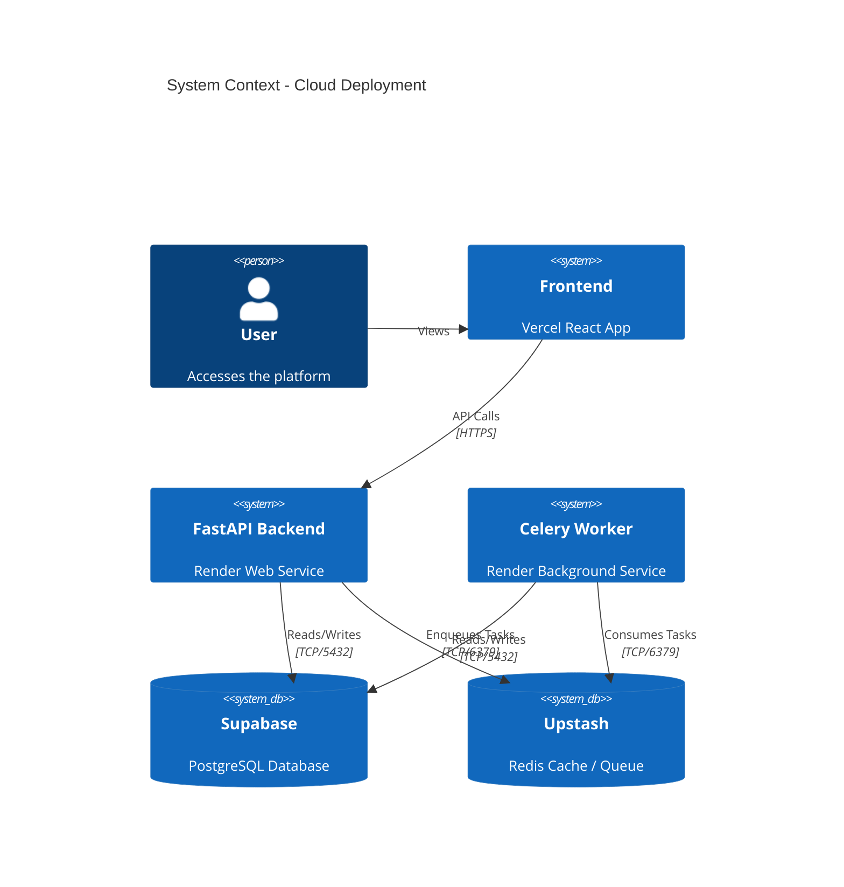

## Context
We have a FastAPI backend and a Celery worker process currently running locally. Our PostgreSQL database and Redis cluster are already managed and hosted in the cloud (Supabase and Upstash). To complete the cloud transition, both the FastAPI application and Celery worker must be deployed to a Platform-as-a-Service (PaaS) to decouple them from the local development environment and allow public Internet access from our Vercel frontend.

## Goals / Non-Goals
**Goals:**
- Deploy FastAPI app as a web service.
- Deploy Celery as a background worker service.
- Use a single repository source (monorepo backend directory) for both services.
- Configure all required environment variables for DB and Redis connections.

**Non-Goals:**
- Modifying the frontend application code (aside from the `VITE_API_BASE_URL` environment variable).
- Setting up a custom domain for the backend.
- Migrating the database from Supabase to the PaaS.

## Decisions

### 1. PaaS Selection (Render)
Render is an excellent choice for Python web and worker services. It supports building directly from a Dockerfile or using native Python environments. We will configure a `render.yaml` Blueprint (Infrastructure-as-Code) to define both the Web Service (FastAPI) and Background Worker (Celery).

### Architecture (C4 Diagram)

### 2. Deployment Method
We will utilize the existing `backend/Dockerfile`. The Web Service will override the start command to run `uvicorn app.main:app --host 0.0.0.0 --port 8000`, while the Background Service will use the same Docker image but run `celery -A app.worker.celery_app worker --loglevel=info`.

## Risks / Trade-offs
- **Risk:** Build failures on the PaaS due to missing system dependencies. -> **Mitigation:** We are using a unified `Dockerfile` which isolates system dependencies perfectly for both Web and Worker services.
- **Risk:** High latency between Render, Supabase, and Upstash. -> **Mitigation:** We will deploy Render services in the Singapore (APAC) region to ensure minimal latency.

## Migration Plan
1. Commit and push the `render.yaml` configuration to GitHub.
2. Connect the GitHub repository to Render using the Blueprint sync.
3. Add the production `DATABASE_URL` (Supabase Connection Pooler) and `REDIS_URL` (Upstash) to the Render environment variables dashboard.
4. Deploy the services.
5. Update Vercel's `VITE_API_BASE_URL` to point to the new Render Web Service URL.

## Open Questions
- None. (Region selection resolved: Singapore APAC).
