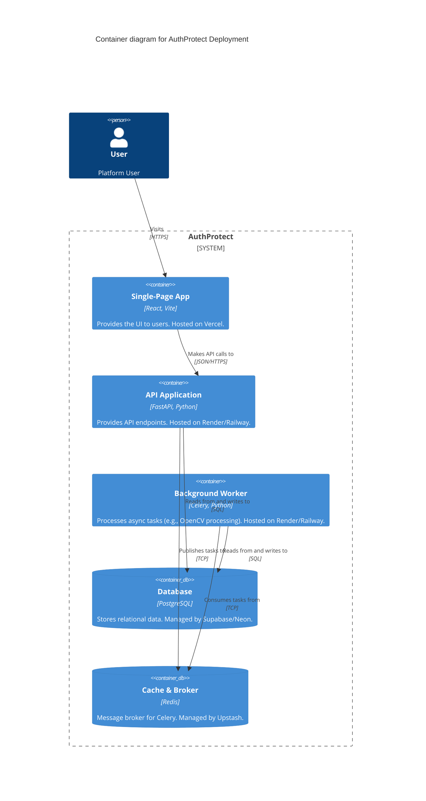

## Context

The AuthProtect (Product Trust Platform) application is currently developed and run on `localhost`. To make the platform available for testing, demonstration, and ultimately production use, it must be deployed to cloud infrastructure. The application consists of a React/Vite frontend, a FastAPI backend, a Celery worker for background tasks, a PostgreSQL database, and a Redis instance for message brokering.

## Goals / Non-Goals

**Goals:**
- Establish a reproducible and scalable deployment architecture.
- Containerize the backend and worker services for consistent execution environments.
- Provide managed instances for stateful services (PostgreSQL and Redis) to reduce maintenance overhead.
- Enable automatic deployments (CI/CD) from the GitHub repository.

**Non-Goals:**
- Setting up a complex orchestration platform like Kubernetes (too much overhead for the current stage).
- Multi-region or high-availability (HA) setups for the initial deployment phase.

## Architecture Diagram

## Decisions

1.  **Frontend Hosting: Vercel / Netlify**
    -   *Rationale*: These platforms are purpose-built for static sites and SPAs like React/Vite. They provide global CDNs, automatic SSL, and zero-configuration CI/CD from GitHub.
    -   *Alternatives considered*: Amazon S3 + CloudFront (requires more manual configuration and terraform).
2.  **Backend & Worker Hosting: Render / Railway**
    -   *Rationale*: These PaaS providers support Dockerfile deployments directly from GitHub. They handle load balancing, SSL termination, and provide a simple dashboard for managing background workers alongside web services.
    -   *Alternatives considered*: AWS ECS or DigitalOcean Droplets (requires significant infrastructure setup and maintenance).
3.  **Database: Managed PostgreSQL (Supabase / Neon)**
    -   *Rationale*: Outsourcing database management ensures automatic backups, easy scaling, and high uptime without needing dedicated DBA resources.
    -   *Alternatives considered*: Self-hosted Postgres on a VPS (risky for data durability and tedious to maintain).
4.  **Message Broker: Managed Redis (Upstash / Render Native)**
    -   *Rationale*: Upstash provides serverless Redis with pay-per-use pricing, which is extremely cost-effective for a Celery broker that may not have constant heavy traffic initially.

## Risks / Trade-offs

-   **[Risk] Vendor Lock-in (PaaS):** Using PaaS platforms like Vercel and Render ties us to their specific configuration formats.
    -   *Mitigation:* By containerizing the backend (`Dockerfile`) and using standard Vite builds for the frontend, we can easily migrate to raw VMs or Kubernetes in the future if needed.
-   **[Risk] Cross-Origin Resource Sharing (CORS) Issues:** The frontend and backend will be on different domains.
    -   *Mitigation:* The FastAPI backend must be carefully configured to accept the specific production origin of the frontend via environment variables.

## Migration Plan

1.  Provision the managed PostgreSQL and Redis instances.
2.  Run Alembic migrations against the production database URI.
3.  Deploy the backend API and Celery worker with the necessary environment variables (`DATABASE_URL`, `REDIS_URL`).
4.  Deploy the frontend application with the `VITE_API_BASE_URL` pointing to the live backend.
5.  Verify end-to-end functionality (registration, background task processing).

## Open Questions

-   Which specific PaaS (Render vs. Railway) do we prefer for the backend based on current budget and team familiarity?
